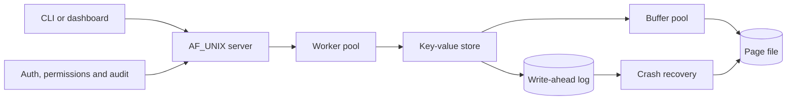

# DuraKV

DuraKV is a crash-safe, multi-client key-value store written in C. It brings
processes, threads, paging, file security and local IPC into one testable
system rather than treating them as separate demonstrations.

## What it demonstrates

| Area | Implementation | Evidence |
|---|---|---|
| Process management | `fork`, signals, `waitpid`, worker threads, mutexes, condition variables and round-robin scheduling | race, deadlock, scheduler and load tests |
| Memory management | write-back buffer pool with FIFO and LRU replacement | hit-ratio tests and Belady's anomaly |
| File system and security | WAL recovery, POSIX permissions, Argon2id authentication, XChaCha20-Poly1305 encryption and a hash-chained audit log | recovery, access-control, encryption and tamper tests |
| Network programming and IPC | concurrent `AF_UNIX` server, length-prefixed protocol and System V message queue | multi-client and message-queue tests |



## Build and verify

Requirements: a C11 compiler, `make`, POSIX threads and
[libsodium](https://doc.libsodium.org/). On macOS:

```bash
brew install libsodium
make
make test
```

Useful verification targets:

```bash
make demo                  # guided coursework demonstration
make crashtest             # repeated kill -9 recovery test
make crashtest_concurrent  # recovery under concurrent writers
make clean
```

## Run the store

```bash
./durakv data.db wal.log
```

The interactive menu supports set, get, delete, list, statistics and
checkpoint operations. The same executable accepts line commands when input is
piped, which is how the crash tests drive it.

## Run the client and server

Start the server:

```bash
./durakv-server /tmp/durakv.sock data.db wal.log 4
```

Connect from another terminal:

```bash
./durakv-client /tmp/durakv.sock
```

The protocol supports `PING`, `AUTH`, `SET`, `GET`, `DEL`, `STATS` and `QUIT`.
Messages use a four-byte big-endian length followed by the payload.

## Open the dashboard

```bash
./durakv-web
```

Then open `http://127.0.0.1:8080`. The dashboard drives the real C server and
shows live key-value operations, cache statistics, security checks and a
crash-recovery run. It is a demonstration bridge; the assessed IPC transport
remains the Unix-domain socket.

## Configuration

| Variable | Purpose |
|---|---|
| `DURAKV_FRAMES=<n>` | buffer-pool frame count; default `64` |
| `DURAKV_POLICY=fifo\|lru` | replacement policy; default `lru` |
| `DURAKV_PASSWORD=<password>` | enable encryption at rest |
| `DURAKV_SECURE=1` | require authentication and permission checks on the server |
| `DURAKV_AUDIT=<path>` | select the audit-log path |

## Key tests

| Command | What it verifies |
|---|---|
| `./test_wal_recovery` | committed updates are reconstructed from the WAL |
| `./test_belady` | FIFO faults rise from 9 to 10 when frames rise from 3 to 4; LRU falls from 10 to 8 |
| `./loadtest` | concurrent work completes through the thread pool |
| `./test_ipc` | eight clients exchange verified framed requests over `AF_UNIX` |
| `./test_secure` | authentication, permissions and the audit chain work end to end |
| `./demo_encrypt` | data and WAL contents are encrypted at rest |

## Repository layout

```text
include/   public C headers
src/       storage, recovery, concurrency, IPC and security modules
tests/     automated tests and focused demonstrations
scripts/   crash-test and guided-demo scripts
web/       browser dashboard
```

## Scope

DuraKV is a coursework-scale local store, not a production database. The audit
chain is tamper-evident rather than tamper-proof, the server intentionally uses
local `AF_UNIX` IPC, and each commit performs a durability sync. These limits
are deliberate and keep the operating-system behaviour visible and testable.
